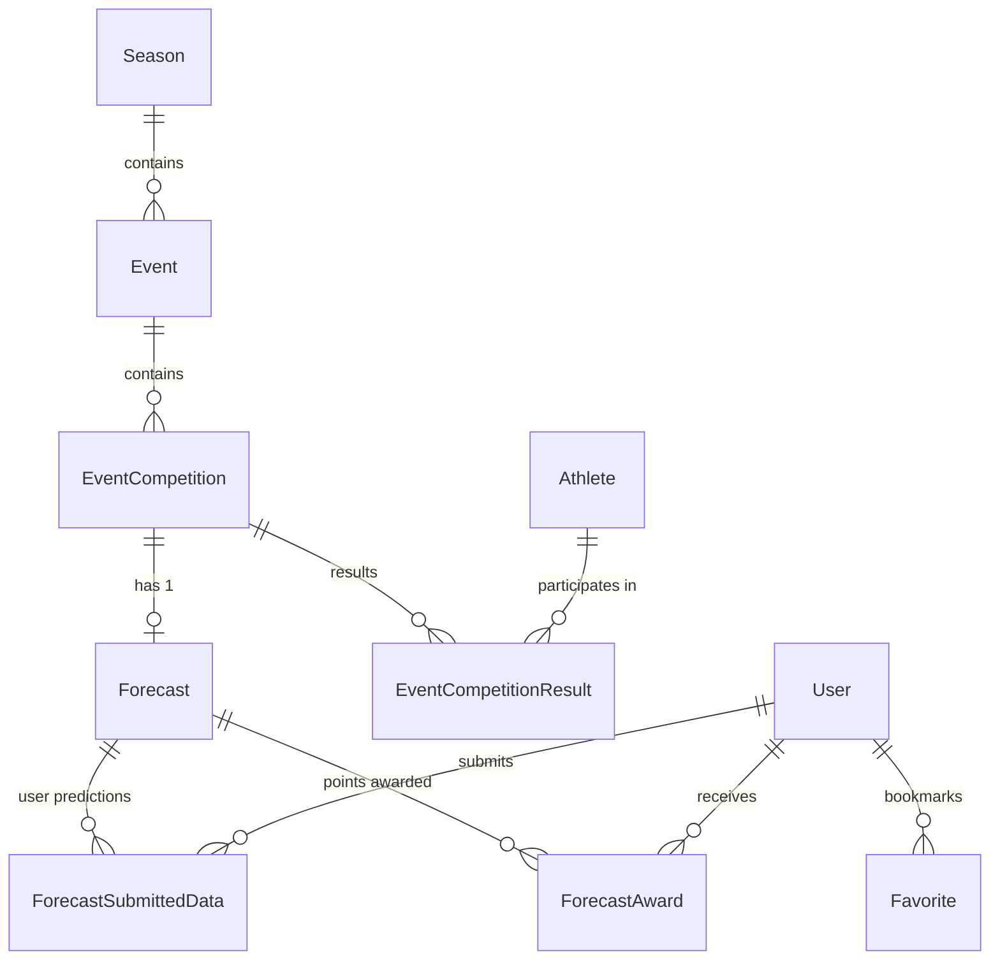
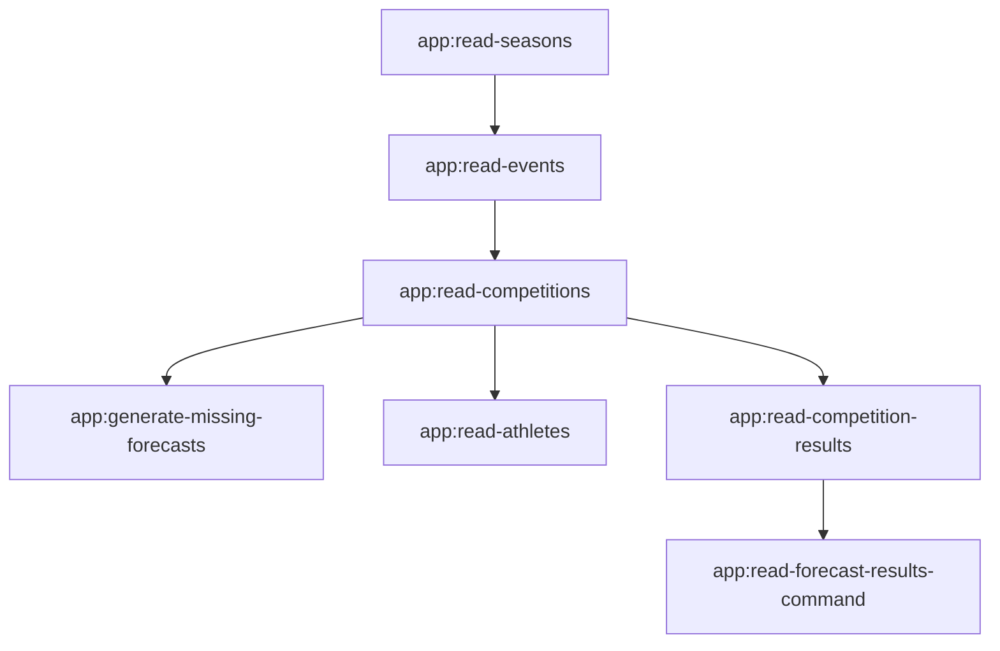

# AGENTS.md - Biathlon Platform AI Agent & Developer Guide

Welcome to the **Biathlon** platform codebase. This document serves as the single source of truth for AI agents (e.g., Google Antigravity, Claude, ChatGPT) and software engineers working on this repository.

---

## 1. Project Overview & Domain Context

**Biathlon** is a Laravel-based platform that combines real-time International Biathlon Union (IBU) World Cup tracking with a competitive **Forecast (Fantasy/Prediction)** game.

### Core Domain Capabilities
1. **IBU API Data Sync**: Integrates with the official IBU Sport API (`https://biathlonresults.com/modules/sportapi/api/`) to pull seasons, events (World Cup stages), competitions (races), live results, and athlete bios/statistics.
2. **Forecast Game Engine**:
   - For every competition/race, users select their predicted top 6 athletes before the race starts (`submit_deadline_at`).
   - Supports individual competitions (Sprint, Pursuit, Individual, Mass Start) and team disciplines (Relays, Single Mixed Relays).
   - Once official results are published, an automated scoring system calculates points and populates leaderboards.
3. **Pluggable Scoring Algorithms**:
   - **Classic Scheme (`FORECAST_FIRST_SIX_PLACES`)**: Fixed points for exact positions (25/20/15/5/5/5) plus bonus combinations (Perfection, Pair/All sets).
   - **Dainis Scheme (`FORECAST_DAINIS_SCHEMA`)**: Precision-delta matrix based on absolute rank difference ($|\text{predicted} - \text{actual}|$) plus Gold/Silver/Bronze podium bonuses.
4. **Interactive HTMX Frontend**: Uses server-rendered Blade templates enhanced with [HTMX](https://htmx.org/), [Alpine.js](https://alpinejs.dev/), and [Tailwind CSS](https://tailwindcss.com/) for fluid, dynamic, full-page or partial element interactions without single-page application (SPA) overhead.

---

## 2. Technology Stack

| Layer | Technology | Details |
| :--- | :--- | :--- |
| **Language** | PHP 8.2+ | Strict typing, typed properties, Enums, match expressions |
| **Framework** | Laravel 11.9+ | Modern Laravel 11 structure (`bootstrap/app.php`, minimal kernel) |
| **Authentication** | Laravel Fortify & `ycore/fortify-tailwind` | Custom two-factor auth (2FA) and profile management |
| **Database** | MySQL (Production) / SQLite | Uses JSON columns and MySQL generated stored columns |
| **Frontend UI** | Blade + HTMX + AlpineJS + TailwindCSS | Single-roundtrip server-driven partial rendering |
| **Build System** | Vite 5.0 | `vite.config.js`, `postcss`, `autoprefixer` |
| **Testing** | PHPUnit 11 | Unit tests for scoring logic in `tests/Unit` |
| **External API** | IBU Sport API | Encapsulated in `App\Services\BiathlonResultApi` |

---

## 3. Directory Layout & Architecture

```text
biathlon/
├── app/
│   ├── Actions/Fortify/          # Fortify user actions (CreateNewUser, UpdateProfile, etc.)
│   ├── Casts/                    # Custom Eloquent Casts (ForecastFinalDataCast, AthleteDetailsCast)
│   ├── Console/Commands/         # Artisan commands for syncing IBU data & calculating scores
│   ├── Enums/                    # Typed enums (DisciplineEnum, CompetitionCategoryEnum, etc.)
│   │   └── Forecast/             # ForecastTypeEnum, ForecastStatusEnum, AwardPointEnum
│   ├── Helpers/                  # Fluent domain helpers & view builders
│   │   ├── Forecasts/            # PointCalculator, FirstSixPlaces, DainisServiceHelper
│   │   └── Generic/              # GenericViewIndexHelper, GenericViewShowHelper
│   ├── Http/
│   │   ├── Controllers/          # Single-action invokable controllers grouped by domain
│   │   │   ├── Athletes/         # Index and profile views
│   │   │   ├── Competitions/     # Race details and results
│   │   │   ├── Events/           # Event stage views
│   │   │   ├── Favorites/        # Favorite toggle actions
│   │   │   ├── Forecasts/        # Forecast show, athlete selection, submit, moves, summary
│   │   │   └── Private/          # User dashboard and profile
│   │   └── Middleware/           # AuthMiddleware
│   ├── Jobs/                     # Background queue jobs (UserLogJob)
│   ├── Models/                   # Eloquent Models (Athlete, Event, EventCompetition, Forecast, etc.)
│   ├── Providers/                # AppServiceProvider, FortifyServiceProvider
│   ├── Services/                 # BiathlonResultApi (HTTP client for IBU sport API)
│   └── ValueObjects/             # Strongly typed data transfer objects (FinalData, User, Athlete, Stats)
├── config/                       # Standard Laravel configuration files
├── database/
│   ├── migrations/               # Database schema definitions
│   └── seeders/                  # Database seeders
├── docs/                         # Detailed architecture, scoring, API, and command guides
├── resources/
│   ├── css/ & js/                # Tailwind CSS and Vite assets
│   └── views/                    # Blade templates (layouts, generic components, forecasts, etc.)
├── routes/
│   ├── console.php               # Console commands & schedule definitions
│   └── web.php                   # Web endpoints & route groups
└── tests/
    ├── Feature/                  # Feature tests
    └── Unit/                     # Unit test suites (e.g. PointCalculatorServiceHelperTest)
```

---

## 4. Key Domain Entities & Data Flow



### Entity Summaries
- **`Season`** (`app/Models/Season.php`): Represents a biathlon season (e.g., `2425` for 2024/2025).
- **`Event`** (`app/Models/Event.php`): A World Cup or World Championship stage (e.g., Östersund, Hochfilzen, Oberhof).
- **`EventCompetition`** (`app/Models/EventCompetition.php`): An individual race within an event (e.g., Men 10km Sprint, Women 4x6km Relay).
- **`Athlete`** (`app/Models/Athlete.php`): Competitors or country teams (`is_team`). Contains IBU bios, shooting accuracy, and skiing speed stats stored in JSON (`details`) and MySQL generated columns (`stat_p_total`, `stat_shooting`, etc.).
- **`EventCompetitionResult`** (`app/Models/EventCompetitionResult.php`): Actual race finish data (rank, time, shooting splits, WC points).
- **`Forecast`** (`app/Models/Forecast.php`): The prediction contest for a competition. Stores state (`COMING`, `ONGOING`, `COMPLETED`), deadline (`submit_deadline_at`), scoring type (`ForecastTypeEnum`), and a denormalized JSON snapshot (`final_data` cast to `FinalDataValueObject`).
- **`ForecastAward`** (`app/Models/ForecastAward.php`): Aggregated regular and bonus points awarded to each user for a forecast.
- **`Favorite`** (`app/Models/Favorite.php`): Polimorphic/typed favorites for quick user access to top athletes.

---

## 5. Value Objects & Custom Eloquent Casts

The codebase avoids unstructured associative arrays by employing typed Value Objects:

1. **`ForecastFinalDataCast`** (`app/Casts/ForecastFinalDataCast.php`):
   - Backed by the `forecasts.final_data` JSON column.
   - Casts to `FinalDataValueObject` containing:
     - `results`: List of `AthleteValueObject` (1st to 12th official finishers).
     - `users`: List of `UserValueObject` containing predicted athletes (places 0–5), `points` (`PointValueObject[]`), and `pointDetails`.
2. **`AthleteDetailsCast`** (`app/Casts/AthleteDetailsCast.php`):
   - Casts raw IBU API bios and JSON results into structured `AthleteDetailsValueObject`.
3. **`AthleteStatsDetailsCast`** (`app/Casts/AthleteStatsDetailsCast.php`):
   - Maps shooting percentages (standing, prone), skiing speeds, and discipline scores into `AthleteStatsDetailValueObject`.

---

## 6. Scoring System Overview

Every forecast resolves through an implementation of `ForecastAbstractionHelper`:

| Scoring Algorithm | Enum Value | Helper Class | Mechanics |
| :--- | :--- | :--- | :--- |
| **Classic Scheme** | `FORECAST_FIRST_SIX_PLACES` | `ForecastFirstSixPlacesServiceHelper` | **Main Points**: Exact matches for 1st (25/15), 2nd (20/12), 3rd (15/8), 4th-6th (5/4).<br>**Bonus Points**: Perfect podium (25/10), Pair matches (5/2, 12/5, 20/10), 4th-6th group sets (2/1, 5/2, 10/4). |
| **Dainis Scheme** | `FORECAST_DAINIS_SCHEMA` | `ForecastDainisServiceHelper` | **Main Points**: Precision-delta score for every predicted athlete that finished in top 6, awarded based on $\|\text{predicted} - \text{actual}\|$ (diff $0 \to 21/7$, $1 \to 15/5$, $2 \to 12/4$, $3 \to 9/3$, $4 \to 6/2$, $5 \to 3/1$).<br>**Bonus Points**: Exact podium medals (Gold $21/7$, Silver $15/5$, Bronze $9/3$). |

> For full formulas, edge cases, and matrix override capabilities, see [docs/SCORING_SYSTEM.md](file:///Users/agrismarkus/code1/biathlon/docs/SCORING_SYSTEM.md).

---

## 7. Scheduled Tasks & Synchronization Pipeline

All background routines are defined in `routes/console.php` and implemented in `app/Console/Commands/`:



### Schedule Cadence:
- `app:read-forecast-results-command`: Runs **every minute** (`* * * * *`). Detects completed races and computes user awards.
- `app:read-competition-results`: Runs **every 5 minutes** (`*/5 * * * *`). Pulls live race results from IBU API.
- `app:generate-missing-forecasts`: Runs **daily**. Creates forecast entries for upcoming races within 3 months.
- `app:read-athletes`: Runs **daily**. Refreshes athlete biographies and seasonal statistics.

> For execution instructions and flags, see [docs/COMMANDS_AND_CRON.md](file:///Users/agrismarkus/code1/biathlon/docs/COMMANDS_AND_CRON.md).

---

## 8. Coding Standards & AI Agent Guidelines

When writing or modifying code in this repository, always adhere to the following rules:

### 1. Architectural Rules
- **Invokable Controllers**: Web endpoints should use single-action controllers with `__invoke()`. Group related controllers in domain folders (e.g., `app/Http/Controllers/Forecasts/`).
- **No Raw Arrays for Domain Payloads**: Use Value Objects (`App\ValueObjects\...`) for multi-attribute structures rather than untyped associative arrays.
- **Enums Over Magic Strings**: Always use typed Enums (`DisciplineEnum`, `CompetitionCategoryEnum`, `ForecastTypeEnum`, `AwardPointEnum`, `FavoriteTypeEnum`).
- **Leverage Fluent View Helpers**: For index tables and show views, prefer `GenericViewIndexHelper` and `GenericViewShowHelper` which provide built-in HTMX, pagination, and session filter persistence.

### 2. Database & Migrations
- Be aware of MySQL-specific generated stored columns in the `athletes` table (`2024_12_21_130259_update_athlete_table.php`).
- When adding migrations, ensure compatibility with both MySQL (production) and SQLite (if running unit tests).

### 3. HTMX & Frontend Conventions
- Use `hx-get`, `hx-post`, `hx-target`, and `hx-indicator` attributes for partial updates.
- Controller responses for HTMX requests should return partial Blade views or utilize `GenericViewIndexHelper::doNotUseLayout()`.
- Dispatch custom events via `HX-Trigger` headers when actions complete (e.g. `HX-Trigger: getIsUserCompletedForecastData-{id}`).

### 4. Testing
- Always run the unit test suite after modifying scoring helpers or value objects:
  ```bash
  ./vendor/bin/phpunit tests/Unit
  ```

---

## 9. Quick Documentation Index

- [Architecture & Design Deep-Dive](file:///Users/agrismarkus/code1/biathlon/docs/ARCHITECTURE.md)
- [Scoring Systems & Mathematical Rules](file:///Users/agrismarkus/code1/biathlon/docs/SCORING_SYSTEM.md)
- [IBU Sport API Integration Guide](file:///Users/agrismarkus/code1/biathlon/docs/API_INTEGRATION.md)
- [Artisan Commands & Background Schedulers](file:///Users/agrismarkus/code1/biathlon/docs/COMMANDS_AND_CRON.md)
