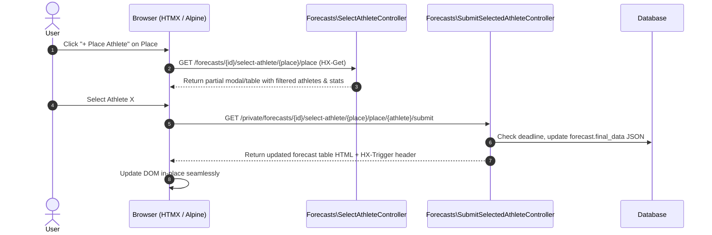

# Architecture & Technical Design

This document details the architectural patterns, data modeling decisions, Eloquent abstractions, and frontend lifecycle in the Biathlon application.

---

## 1. High-Level Architectural Layers

The Biathlon application is structured following a domain-oriented Layered Architecture with server-driven reactive UI:

```text
┌────────────────────────────────────────────────────────┐
│             Presentation Layer (Blade + HTMX)          │
│   - GenericViewIndexHelper / GenericViewShowHelper     │
│   - Tailwind CSS / Alpine.js dynamic client state      │
└─────────────────────────┬──────────────────────────────┘
                          │ HTTP Requests / HTMX Calls
┌─────────────────────────▼──────────────────────────────┐
│             Routing & Controller Layer                 │
│   - Invokable Controllers (Single-Action)              │
│   - AuthMiddleware / Fortify Authentication            │
└─────────────────────────┬──────────────────────────────┘
                          │ Data retrieval / Mutations
┌─────────────────────────▼──────────────────────────────┐
│               Service & Helper Layer                   │
│   - BiathlonResultApi (External API Client)            │
│   - Forecast Calculation Helpers (Dainis / Classic)    │
│   - Value Objects (Immutable Data Transfer Objects)    │
└─────────────────────────┬──────────────────────────────┘
                          │ Eloquent ORM & Custom Casts
┌─────────────────────────▼──────────────────────────────┐
│             Persistence & Database Layer               │
│   - Eloquent Models (Event, Forecast, Athlete, etc.)   │
│   - JSON Casts (ForecastFinalDataCast, DetailsCast)    │
│   - MySQL Stored Generated Columns (Stats indexing)    │
└────────────────────────────────────────────────────────┘
```

---

## 2. Domain Data Model & Relationships

### Core Relational Hierarchy
1. **`Season`**
   - Has many **`Event`** records (`Season::events()`).
   - Represents IBU operational years (e.g. `2425` = 2024–2025 season).
2. **`Event`**
   - Belongs to a **`Season`** (`Event::season()`).
   - Has many **`EventCompetition`** records (`Event::competitions()`).
   - Encapsulates geographic stage data (e.g. Ruhpolding, Antholz-Anterselva), level (`level=1` for World Cup), altitude, and dates.
3. **`EventCompetition`**
   - Belongs to an **`Event`** (`EventCompetition::event()`).
   - Has many **`EventCompetitionResult`** records (`EventCompetition::results()`).
   - Has one **`Forecast`** record (`EventCompetition::forecast()`).
   - Contains race parameters: distance (`km`), discipline (`discipline_remote_id`), gender category (`cat_remote_id`), number of shootings, spare rounds, and start time (`start_time`).
4. **`Athlete`**
   - Has many **`EventCompetitionResult`** records.
   - Represents an individual athlete or a national relay team (`is_team = true`).
   - Contains basic demographic data (`family_name`, `given_name`, `nat`, `flag_uri`, `photo_uri`) and detailed IBU career stats in JSON (`details`).
5. **`EventCompetitionResult`**
   - Belongs to **`EventCompetition`** and **`Athlete`**.
   - Contains finish rank (`rank`), bib number (`bib`), shooting splits (`shootings`, `shooting_total`), total race duration (`total_time`), and World Cup points earned (`wc`).
6. **`Forecast`**
   - Belongs to an **`EventCompetition`**.
   - Has many **`ForecastSubmittedData`** (user submissions) and **`ForecastAward`** (calculated scores).
   - Holds denormalized JSON `final_data` containing both official podium results and all user predictions with calculated scores.
7. **`ForecastAward`**
   - Belongs to a **`User`** and **`Forecast`**.
   - Stores regular points (`AwardPointEnum::REGULAR_POINT`) and bonus points (`AwardPointEnum::BONUS_POINT`).
8. **`Favorite`**
   - Stores user-specific athlete bookmarks (`type = 'athlete'`) for expedited forecast selection.

---

## 3. Custom Eloquent Casts & Typed Value Objects

Rather than dealing with loose JSON strings or unstructured PHP arrays, the application implements strongly-typed Value Objects via Eloquent Casts.

### 1. `ForecastFinalDataCast` & `FinalDataValueObject`
- **Model Property**: `Forecast::$final_data`
- **Database Column**: `forecasts.final_data` (`JSON`)
- **Structure**:
  ```php
  FinalDataValueObject
  ├── results: AthleteValueObject[] (Rank 1 to 12)
  └── users: UserValueObject[]
      ├── id: int
      ├── name: string
      ├── points: PointValueObject[] (Regular & Bonus)
      ├── pointDetails: PointValueObject[][] (Breakdown per rank)
      └── athletes: AthleteValueObject[] (Places 1 to 6)
  ```
- **Advantages**:
  - Encapsulates domain logic (e.g. `getUserByUserModel()`, `updateUser()`, `getPointsByType()`).
  - Serializes and deserializes transparently with safety validation.

### 2. `AthleteDetailsCast` & `AthleteStatsDetailsCast`
- **Model Properties**: `Athlete::$details`, `EventCompetitionResult::$stat_details`
- **Database Columns**: `athletes.details` (`JSON`), `event_competition_results.stat_details` (`JSON`)
- **Structure**:
  - `AthleteDetailsValueObject`: Normalized holder for IBU bios, career trophies, and seasonal statistics.
  - `AthleteStatsDetailValueObject`: Holds shooting accuracy (`statShooting`, `statShootingProne`, `statShootingStanding`), skiing speeds (`statSkiing`, `statsSkiKmb`), and discipline-specific standings (`statsSeasonPointsSprint`, `statsSeasonPointsIndividual`, `statsSeasonPointsPursuit`, `statsSeasonPointsMass`).

---

## 4. MySQL Generated Stored Columns

To allow fast SQL querying, filtering, and sorting without parsing JSON at runtime, the `athletes` table utilizes MySQL stored generated columns extracted directly from `athletes.details`:

```sql
ALTER TABLE athletes
ADD COLUMN stat_season VARCHAR(10) GENERATED ALWAYS AS (JSON_VALUE(details, '$.StatSeasons[0]')) STORED,
ADD COLUMN stat_p_total DECIMAL(5,2) GENERATED ALWAYS AS (CAST(JSON_VALUE(details, '$.RNKS[0].Total') AS DECIMAL(5,2))) STORED,
ADD COLUMN stat_p_sprint DECIMAL(5,2) GENERATED ALWAYS AS (CAST(JSON_VALUE(details, '$.RNKS[0].Sprint') AS DECIMAL(5,2))) STORED,
ADD COLUMN stat_p_individual DECIMAL(5,2) GENERATED ALWAYS AS (CAST(JSON_VALUE(details, '$.RNKS[0].Individual') AS DECIMAL(5,2))) STORED,
ADD COLUMN stat_p_pursuit DECIMAL(5,2) GENERATED ALWAYS AS (CAST(JSON_VALUE(details, '$.RNKS[0].Pursuit') AS DECIMAL(5,2))) STORED,
ADD COLUMN stat_p_mass DECIMAL(5,2) GENERATED ALWAYS AS (CAST(JSON_VALUE(details, '$.RNKS[0].MassStart') AS DECIMAL(5,2))) STORED,
ADD COLUMN stat_skiing DECIMAL(5,2) GENERATED ALWAYS AS (CAST(REPLACE(JSON_VALUE(details, '$.StatSkiing[0]'), '%', '') AS DECIMAL(5,2))) STORED,
ADD COLUMN stat_shooting DECIMAL(5,2) GENERATED ALWAYS AS (CAST(REPLACE(JSON_VALUE(details, '$.StatShooting[0]'), '%', '') AS DECIMAL(5,2))) STORED,
ADD COLUMN stat_shooting_prone DECIMAL(5,2) GENERATED ALWAYS AS (CAST(REPLACE(JSON_VALUE(details, '$.StatShootingProne[0]'), '%', '') AS DECIMAL(5,2))) STORED,
ADD COLUMN stat_shooting_standing DECIMAL(5,2) GENERATED ALWAYS AS (CAST(REPLACE(JSON_VALUE(details, '$.StatShootingStanding[0]'), '%', '') AS DECIMAL(5,2))) STORED;
```

---

## 5. UI Architecture: Fluent Helpers & HTMX

The presentation layer avoids frontend framework bloat (e.g. React/Vue bundles) by combining Laravel Blade with **HTMX** and fluent helper classes.

### 1. `GenericViewIndexHelper` (`app/Helpers/Generic/GenericViewIndexHelper.php`)
A fluent builder for data tables supporting:
- Dynamic column formatting with closures (`setDataKeys([fn($row) => ...])`).
- Paginated results (`setData(LengthAwarePaginator)`).
- Session-persistent filter forms (`setFilters([FilterValueObject, ...])`).
- HTMX target binding (`useHtmx()`, `htmxTargetElement('#target-div')`).
- Layout toggling (`doNotUseLayout()` for HTMX partial response rendering).

### 2. Forecast Selection & Submission Flow


---

## 6. Authentication & Authorization

- Handled via **Laravel Fortify** configured in `config/fortify.php` and `app/Providers/FortifyServiceProvider.php`.
- Protected routes reside in the `private` route group protected by `App\Http\Middleware\AuthMiddleware`:
  ```php
  Route::group([
      'prefix' => 'private',
      'middleware' => AuthMiddleware::class,
  ], function () {
      // Forecast submissions, position adjustments, favorites, profile
  });
  ```
- Submissions are strictly verified against race start time:
  ```php
  if ($forecast->submit_deadline_at->lt(now())) {
      abort(401, 'Forecast is closed');
  }
  ```
