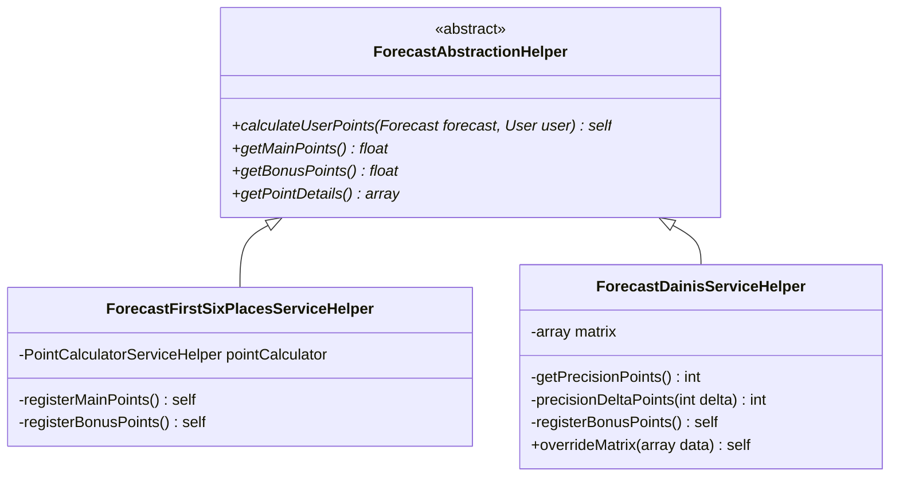
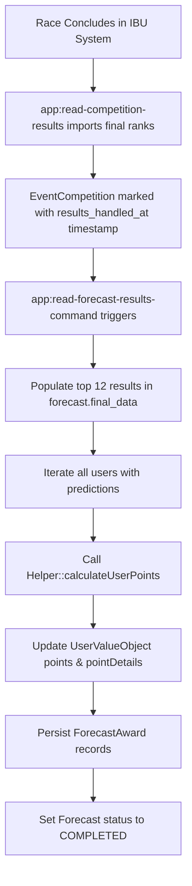

# Scoring System & Forecast Calculation Engines

This document provides a comprehensive mathematical and procedural specification of the forecast scoring mechanisms implemented in the Biathlon platform.

---

## 1. Overview

The platform supports pluggable forecast scoring strategies implementing `App\Helpers\Forecasts\ForecastAbstractionHelper`. The strategy used for any given race is determined by `Forecast::$type` (`App\Enums\Forecast\ForecastTypeEnum`).



---

## 2. Scheme 1: Classic Scheme (`FORECAST_FIRST_SIX_PLACES`)

**Implementation**: `App\Helpers\Forecasts\ForecastFirstSixPlacesServiceHelper`

Evaluates exact position matches for the top 6 positions, accompanied by multi-tier bonus structures for podium combinations and 4th–6th group placements.

### Main Points (Exact Matches)

| Position | Individual Races (pts) | Team Races / Relays (pts) | Condition |
| :--- | :---: | :---: | :--- |
| **1st Place (Gold)** | **25** | **15** | Predicted 1st == Actual 1st |
| **2nd Place (Silver)** | **20** | **12** | Predicted 2nd == Actual 2nd |
| **3rd Place (Bronze)** | **15** | **8** | Predicted 3rd == Actual 3rd |
| **4th Place** | **5** | **4** | Predicted 4th == Actual 4th |
| **5th Place** | **5** | **4** | Predicted 5th == Actual 5th |
| **6th Place** | **5** | **4** | Predicted 6th == Actual 6th |

### Bonus Points

#### Bonus 1: Perfection Bonus
Awarded if the user correctly guessed the exact order of the entire podium (1st, 2nd, and 3rd).
- **Individual**: **+25 points**
- **Team**: **+10 points**

#### Bonus 2: Podium Permutation Bonus
Evaluates how many podium finishers (places 1–3) the user correctly identified, regardless of exact positions:
- **1 Correct**: +5 pts (Individual) / +2 pts (Team)
- **Pair (2 Correct)**: +12 pts (Individual) / +5 pts (Team)
- **All (3 Correct, but not in exact order)**: +20 pts (Individual) / +10 pts (Team)

#### Bonus 3: 4th to 6th Group Permutation Bonus
Evaluates how many 4th–6th place finishers the user identified anywhere in positions 4–6:
- **1 Correct**: +2 pts (Individual) / +1 pt (Team)
- **Pair (2 Correct)**: +5 pts (Individual) / +2 pts (Team)
- **All (3 Correct)**: +10 pts (Individual) / +4 pts (Team)

---

## 3. Scheme 2: Dainis Scheme (`FORECAST_DAINIS_SCHEMA`)

**Implementation**: `App\Helpers\Forecasts\ForecastDainisServiceHelper`

Introduced for more nuanced, delta-based precision rewarding. Users earn points based on how close their prediction was to the actual finish position, plus direct medal bonuses.

### 1. Precision Delta Points (Main Points)

For each user-predicted athlete $i \in \{0, 1, 2, 3, 4, 5\}$:
1. Locate athlete's actual finish position $j \in \{0, 1, 2, 3, 4, 5\}$ in the official race results.
2. If the athlete finished in the top 6, calculate the absolute rank difference:
   $$\Delta = |j - i|$$
3. Points are awarded from the precision matrix:

| Rank Difference ($\Delta$) | Individual Race Points | Team / Relay Points |
| :---: | :---: | :---: |
| **$\Delta = 0$ (Exact Match)** | **21** | **7** |
| **$\Delta = 1$ (Off by 1 place)** | **15** | **5** |
| **$\Delta = 2$ (Off by 2 places)** | **12** | **4** |
| **$\Delta = 3$ (Off by 3 places)** | **9** | **3** |
| **$\Delta = 4$ (Off by 4 places)** | **6** | **2** |
| **$\Delta = 5$ (Off by 5 places)** | **3** | **1** |
| **Not in Top 6** | **0** | **0** |

### 2. Podium Medal Bonus Points

Awarded additionally for exact podium hits:
- **Exact Gold (1st)**: **+21 pts** (Individual) / **+7 pts** (Team)
- **Exact Silver (2nd)**: **+15 pts** (Individual) / **+5 pts** (Team)
- **Exact Bronze (3rd)**: **+9 pts** (Individual) / **+3 pts** (Team)

### Matrix Configuration & Overrides

The Dainis matrix can be dynamically overridden (e.g. for simulation and testing via `/test-dainis`) using `overrideMatrix(array $data)`:

```php
$dainisCalc = new ForecastDainisServiceHelper();
$dainisCalc->overrideMatrix([
    'regular.individual.0' => 25,
    'bonus.individual.gold' => 25,
]);
```

---

## 4. Team vs. Individual Discipline Resolution

Discipline types are defined in `App\Enums\DisciplineEnum`:
- **Team Disciplines**:
  - `DisciplineEnum::RELAY_COMPETITION` (`'RL'`)
  - `DisciplineEnum::TEAM_COMPETITION` (`'TM'`)
  - `DisciplineEnum::SINGLE_RELAY_MIXED` (`'SR'`)
- **Temp ID Resolution**:
  - For individual races, the athlete's primary database ID (`$athlete->id`) is used for comparisons.
  - For team races, national team codes (`$athlete->nat`) are mapped to avoid duplicate nation picks and represent the entire relay squad.

---

## 5. Result Calculation Pipeline



---

## 6. Verification & Test Suite

The scoring logic is rigorously tested in `tests/Unit/Helpers/Forecasts/PointCalculatorServiceHelperTest.php` with 18 comprehensive data provider scenarios covering:
- Single exact medal hits
- Double and full podium hits
- 4th–6th place permutations
- Inverted orders and partial sets

Run tests using:
```bash
./vendor/bin/phpunit tests/Unit
```
